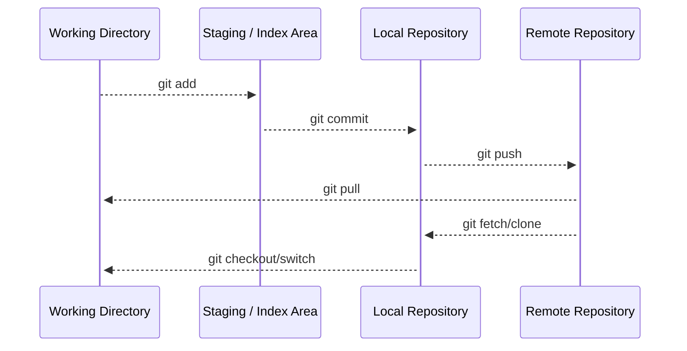

Git 的主要有四个核心区域：
- 工作区（Working Directory）
- 暂存区（Staging / Index Area）
- 本地仓库（Local Repository）
- 远程仓库（Remote Repository）

## 工作区

Git 的工作区是指本地直接编辑的文件夹，包含了项目的所有文件。

## 暂存区

Git 的暂存区是一个临时区域，用于保存你即将提交到本地仓库的文件变更。

## 本地仓库

Git 的本地仓库是指在你本地计算机上存储的 Git 仓库。

在本地仓库中，你可以查看历史版本、切换分支、合并变更等操作。

## 远程仓库

Git 的远程仓库是指存储在服务器上的 Git 仓库，通常用于团队协作和代码共享。

你可以将本地仓库的变更推送到远程仓库，也可以从远程仓库拉取其他人的变更。

:::info
远程仓库通常托管在 GitHub、GitLab、Bitbucket 等平台上
:::

## 分区关系

Git 的分区关系如下：显示最简单的命令操作流程。

