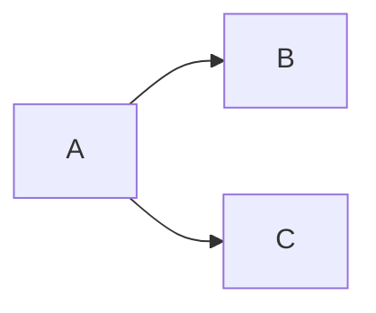
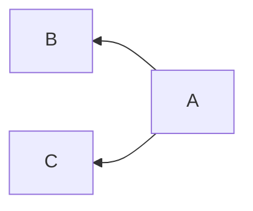
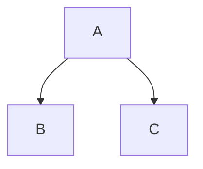
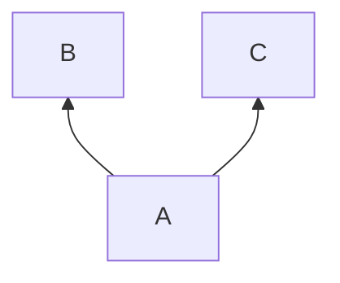
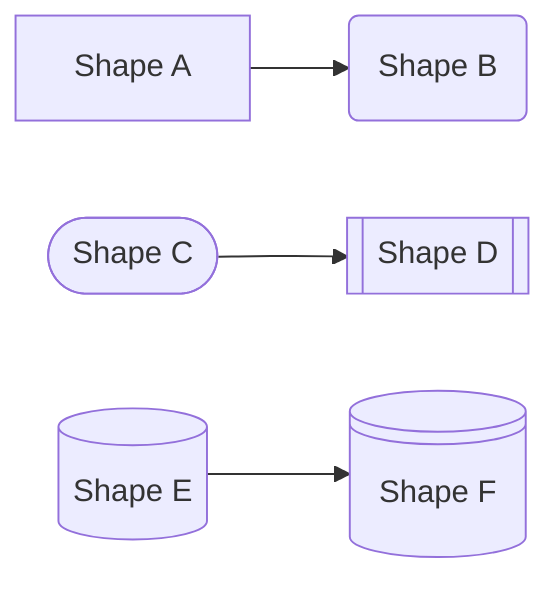

import Tabs from '@theme/Tabs';
import TabItem from '@theme/TabItem';

Mermaid 是一个基于 JavaScript 的图表绘制工具，可以方便的实现文档的图表展示。

:::info Docusaurus
Docusaurus 提供了丰富的插件，可以方便的实现文档的部署！
:::

## 安装 Mermaid

打开终端命令行运行 `yarn add @docusaurus/theme-mermaid` 命令安装 Mermaid 插件。

```bash
yarn add @docusaurus/theme-mermaid
```

## 配置 Mermaid

打开 `docusaurus.config.ts` 文件，添加下面的内容到 `presets` 和 `themeConfig` 中间。

```ts
  markdown: {
    mermaid: true,
  },
  themes: ['@docusaurus/theme-mermaid'],
```

<File title="docusaurus.config.ts">
<p>

```ts {9-12} showLineNumbers
    ···
        theme: {
          customCss: './src/css/custom.css',
        },
      } satisfies Preset.Options,
    ],
  ],

  markdown: {
    mermaid: true,
  },
  themes: ['@docusaurus/theme-mermaid'],

  themeConfig: {
    ···

```

</p>
</File>

## 使用 Mermaid

代码块添加 `mermaid` 字符可以实现图表展示。

:::tip 参考资料
Mermaid 官网：[Mermaid](http://mermaid.js.org)
:::

### 图表方向

Mermaid 支持多种图表方向：

- `LR`：从左到右
- `RL`：从右到左
- `TB`：从上到下
- `BT`：从下到上

<Tabs>
<TabItem value="lr" label="LR">
~~~

~~~
</TabItem>
<TabItem value="lr_preview" label="LR 预览">

</TabItem>
<TabItem value="rl" label="RL">
~~~

~~~
</TabItem>
<TabItem value="rl_preview" label="RL 预览">

</TabItem>
<TabItem value="tb" label="TB">
~~~

~~~
</TabItem>
<TabItem value="tb_preview" label="TB 预览">

</TabItem>
<TabItem value="bt" label="BT">
~~~

~~~
</TabItem>
<TabItem value="bt_preview" label="BT 预览">

</TabItem>
</Tabs>

### 图表形状

Mermaid 支持多种图表形状。

<Tabs>
<TabItem value="tb" label="TB">
~~~

~~~
</TabItem>
<TabItem value="tb_preview" label="TB 预览">

</TabItem>
</Tabs>
